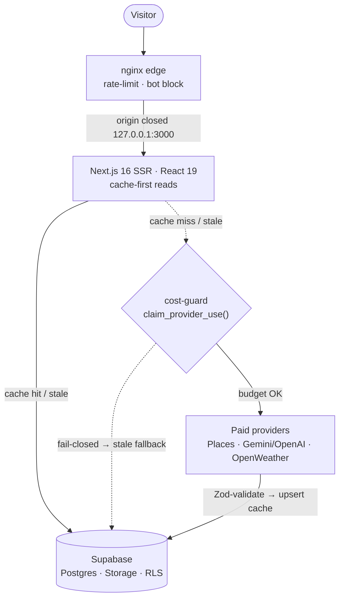
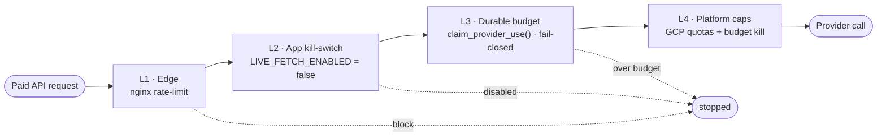

<div align="center">


<br />
<br />

# 🌆 Best City Spots

### A calm, credible atlas for deliberate travel.

Search, compare, and explore the world's cities with **live weather & air quality**, **AI-assisted briefings**, **curated places**, and **transparent city metrics** — in a refined, accessible, _liquid-glass_ interface.

<br />

[](LICENSE)
[](https://nextjs.org/)
[](https://react.dev/)
[](https://www.typescriptlang.org/)
[](https://tailwindcss.com/)
[](https://supabase.com/)
[](https://prettier.io/)
[](#-contributing)

<br />

[**Overview**](#-overview) ·
[**Features**](#-feature-highlights) ·
[**Tech Stack**](#-tech-stack) ·
[**Architecture**](#-architecture) ·
[**Getting Started**](#-getting-started) ·
[**Configuration**](#-environment--service-configuration) ·
[**Scripts**](#-scripts) ·
[**Deployment**](#-deployment) ·
[**Security**](#-security) ·
[**Contributing**](#-contributing)

</div>

---

## 📖 Overview

**Best City Spots** turns the noisy work of destination research into something that feels _edited_. Instead of a dozen tabs, you get one place that fuses **live conditions** (weather, air quality), **real place data** (landmarks, dining, stays from Google Places), **clearly-labeled AI synthesis**, and **practical planning cues** into a single, trustworthy reading experience.

It is built around two convictions:

- **Honesty over hype** — sources stay visible, the AI layer is framed as _assistance, not authority_, and there are no paywalls or dark patterns.
- **Sustainable by design** — every paid API call is bounded by a durable, multi-layer cost guard, so the project can run in production without surprise bills.

> **Who it's for**
>
> - **Travelers** shaping a trip who want signal, not spam — search by name, mood, climate, or season, then compare and plan.
> - **Engineers** looking for a production-grade reference: a Next.js 16 / React 19 app with strict typing, a cache-first data layer, Postgres full-text + fuzzy search, image pipelines, and real cost controls.

<div align="center">

|   🔎 Search & discover    |     🌤️ Live conditions      | 🧠 Labeled AI briefings  |      📊 Compare & plan       |
| :-----------------------: | :-------------------------: | :----------------------: | :--------------------------: |
| FTS + trigram + alias RPC | OpenWeatherMap + Open-Meteo | Gemini ⇄ OpenAI fallback | Up to 3 cities, side-by-side |

</div>

---

## ✨ Feature Highlights

- 🔎 **Elastic city search** — PostgreSQL full-text search + trigram fuzzy matching + an alias table, exposed through the `search_cities_elastic` RPC. Typo-tolerant, ranked by relevance and population, with recent-search memory and GPS nearest-city lookup.
- 🌤️ **Live weather & air quality** — current conditions and AQI per city via **OpenWeatherMap**, with **Open-Meteo** as a keyless fallback so the guide never goes stale.
- 🗺️ **Curated "Top Experiences"** — landmarks, dining, and stays from the **Google Places API (New)**, ranked and de-duplicated, with photos cached to **Supabase Storage** and **BlurHash** placeholders for instant, layout-stable loading.
- 🧠 **AI city briefings** — synthesized overviews, attractions, and seasonal notes via **Google Gemini** with automatic **OpenAI** fallback. Always labeled as machine-assisted, never presented as hidden authority.
- ⚖️ **Side-by-side compare** — put up to three cities head-to-head on live weather, air quality, population, and verified metrics. The URL _is_ the comparison — share it as-is.
- 📈 **Transparent metrics & methodology** — population, region context, and city metrics with a dedicated `/methodology` page explaining every source, refresh cadence, and AI-vs-human attribution.
- 🧭 **Topical SEO hubs** — programmatic, crawl-friendly indexes: _cleanest air_, _best for digital nomads_, _best cities to visit by month_, plus per-country and all-cities indexes.
- 🧳 **Personal planning** — save places and notes on-device (no account wall) and assemble a day-by-day plan.
- 🛡️ **Cost-guarded by default** — a layered defense (edge rate-limits, app kill-switches, a durable atomic daily budget, and cloud quota caps) makes runaway paid-API spend structurally impossible. See [Architecture](#-architecture).
- 🎨 **Refined, accessible UI** — a token-driven _liquid-glass_ design system, dark mode (`next-themes`), Framer Motion micro-interactions, an interactive Leaflet map, and a dedicated accessibility statement.

---

## 🧰 Tech Stack

| Layer                  | Technology                                                                                                                                                                                                                  |
| ---------------------- | --------------------------------------------------------------------------------------------------------------------------------------------------------------------------------------------------------------------------- |
| **Framework**          | [Next.js 16](https://nextjs.org/) (App Router, standalone output) on **Node 20**                                                                                                                                            |
| **Language**           | [TypeScript 5](https://www.typescriptlang.org/) (strict)                                                                                                                                                                    |
| **UI**                 | [React 19](https://react.dev/), [Tailwind CSS 4](https://tailwindcss.com/), [Framer Motion](https://www.framer.com/motion/), [lucide-react](https://lucide.dev/), [next-themes](https://github.com/pacocoursey/next-themes) |
| **Maps & media**       | [Leaflet](https://leafletjs.com/), [sharp](https://sharp.pixelplumbing.com/), [BlurHash](https://blurha.sh/)                                                                                                                |
| **Data & storage**     | [Supabase](https://supabase.com/) — Postgres (FTS + `pg_trgm`), Storage, Row-Level Security                                                                                                                                 |
| **Validation**         | [Zod](https://zod.dev/) (centralized, runtime-validated env + inputs)                                                                                                                                                       |
| **External providers** | Google Gemini · OpenAI · Google Places (New) · OpenWeatherMap · Open-Meteo                                                                                                                                                  |
| **Tooling**            | ESLint 9 (+ `eslint-plugin-security`), Prettier, `tsx`, Tailwind PostCSS                                                                                                                                                    |
| **Deploy**             | Docker (multi-stage standalone) + Docker Compose · Ansible · nginx edge                                                                                                                                                     |

---

## 🏗️ Architecture

The app is **cache-first**: user requests are served from Supabase caches and never trigger a paid API call on their own. Fresh data enters out-of-band through the cache warmer, and a four-layer guard keeps spend bounded even if a layer fails.

**System & cache-first data flow**



**Four-layer cost defense** — a paid request must clear every layer; any one can stop it, so spend stays bounded even if another layer fails.



| Layer                   | Mechanism                                                  | Where                              |
| ----------------------- | ---------------------------------------------------------- | ---------------------------------- |
| **1 · Edge**            | nginx per-IP rate limits + bot blocks                      | `deploy/nginx/bestcityspots.conf`  |
| **2 · App kill switch** | `GOOGLE_*_LIVE_FETCH_ENABLED` (default **false** in prod)  | env / compose                      |
| **3 · Durable budget**  | `claim_provider_use()` atomic per-day counter, fail-closed | Supabase + `src/lib/cost-guard.ts` |
| **4 · Platform caps**   | GCP quota caps + API-key restriction + budget kill         | Google Cloud Console               |

📄 Full operational detail lives in [`deploy/README.md`](deploy/README.md), and a structural map of the codebase in [`PROJECT.md`](PROJECT.md).

---

## 🚀 Getting Started

### Prerequisites

- **Node.js 20+** and npm
- A **Supabase** project (free tier is fine)
- **Python 3.9+** (only for the one-shot Supabase setup script)
- API keys as needed: Google Places (New), Google Gemini and/or OpenAI, OpenWeatherMap

### 1 · Clone & install

```bash
git clone https://github.com/<your-org>/bestcityspots.git
cd bestcityspots
npm install
```

### 2 · Configure environment

```bash
cp .env.example .env.local
# then fill in the values — see "Environment & service configuration" below
```

### 3 · Provision the database

The idempotent setup script applies all schema, RLS, functions, and seeds ~42k cities:

```bash
pip install "psycopg[binary]"
python scripts/setup_supabase.py        # add --skip-seed to re-run schema only
```

Prefer SQL? Paste `supabase/setup_all_blank_project.sql` into the Supabase SQL editor, then seed with `npx tsx scripts/seed-cities.ts data/worldcities.csv` (add `--limit=500` to seed only the top 500 cities by population for a lighter setup).

### 4 · Verify & run

```bash
python scripts/test-keys.py   # checks DB / Places / Weather / AI credentials
npm run test:supabase         # exercises tables, RLS, and the search RPC
npm run dev                   # http://localhost:3000
```

> **💡 Cost note:** In development, set `GOOGLE_PLACES_LIVE_FETCH_ENABLED=true` to let city pages fetch & cache real places on first view. In production this stays `false` — fresh data is loaded by the warmer (`npm run warm-cache`).

---

## 🔐 Environment & Service Configuration

Copy `.env.example` → `.env.local`. All keys are validated at runtime by Zod (`src/lib/env.ts`); the app degrades gracefully when optional ones are absent.

<details>
<summary><strong>Supabase</strong> — required for all data</summary>

| Variable                        | Description                                          |
| ------------------------------- | ---------------------------------------------------- |
| `NEXT_PUBLIC_SUPABASE_URL`      | Project URL (`https://<ref>.supabase.co`)            |
| `NEXT_PUBLIC_SUPABASE_ANON_KEY` | Public anon key (read paths, RLS-protected)          |
| `SUPABASE_SERVICE_ROLE_KEY`     | Server-only: cache writes, image uploads, cost-guard |
| `SUPABASE_DB_URL`               | Postgres URL — only for `scripts/setup_supabase.py`  |

</details>

<details>
<summary><strong>AI briefings</strong> — Gemini ⇄ OpenAI with automatic fallback</summary>

| Variable                           | Default  | Description                                  |
| ---------------------------------- | -------- | -------------------------------------------- |
| `AI_PROVIDER`                      | `gemini` | Preferred engine; the other becomes fallback |
| `GOOGLE_GEMINI_API_KEY`            | —        | Gemini key                                   |
| `OPENAI_API_KEY`                   | —        | OpenAI key                                   |
| `GOOGLE_GEMINI_LIVE_FETCH_ENABLED` | `false`  | Kill switch (prod default: cache-only)       |
| `OPENAI_LIVE_FETCH_ENABLED`        | `false`  | Kill switch                                  |
| `GOOGLE_GEMINI_DAILY_CALL_LIMIT`   | `25`     | Durable daily budget                         |
| `OPENAI_DAILY_CALL_LIMIT`          | `25`     | Durable daily budget                         |

</details>

<details>
<summary><strong>Google Places</strong> (New) — landmarks, dining, stays</summary>

| Variable                           | Default | Description                            |
| ---------------------------------- | ------- | -------------------------------------- |
| `GOOGLE_PLACES_API_KEY`            | —       | Places API (New) key                   |
| `GOOGLE_PLACES_LIVE_FETCH_ENABLED` | `false` | Kill switch (prod default: cache-only) |
| `GOOGLE_PLACES_DAILY_CALL_LIMIT`   | `100`   | Durable daily budget                   |

</details>

<details>
<summary><strong>Weather & optional/site settings</strong></summary>

| Variable                           | Description                                           |
| ---------------------------------- | ----------------------------------------------------- |
| `OPENWEATHERMAP_API_KEY`           | Live weather + AQI (Open-Meteo fallback needs no key) |
| `NEXT_PUBLIC_SITE_URL`             | Canonical site URL (SEO, sitemaps, OG)                |
| `LOG_LEVEL`                        | `debug` \| `info` \| `warn` \| `error`                |
| `HEALTH_CHECK_TOKEN`               | Bearer token for the detailed `/api/health` payload   |
| `NEXT_PUBLIC_CONTACT_EMAIL`        | Surfaced in structured data / contact                 |
| `NEXT_PUBLIC_BOOKING_AFFILIATE_ID` | Affiliate links render only when set (ADR-002)        |

</details>

> 🔒 **Never commit secrets.** `.env*` is gitignored. In production, paid-provider keys are provided **at runtime only** (never baked into Docker layers) and the Places key should be IP-restricted to your server.

---

## 📁 Project Structure

<details>
<summary>Click to expand the directory tree</summary>

```
.
├── src/
│   ├── app/                  # App Router: routes, layouts, server actions
│   │   ├── api/              # REST: analytics, cities/{sphere,insight}, places/{search,save-event}, health
│   │   ├── cities/           # /cities index + /cities/[slug] detail (full guide / reduced profile)
│   │   ├── countries/        # /countries hub + /countries/[slug]
│   │   ├── best-cities-*/     # Topical SEO hubs (air quality, nomads, by month)
│   │   ├── compare/          # Side-by-side city comparison
│   │   ├── actions.ts        # Server actions
│   │   └── globals.css       # Liquid-glass design tokens (single source of truth)
│   ├── components/           # analytics, features, layout, pages, sections, seo, ui
│   ├── hooks/                # useDeviceType, useNetworkQuality, useRecentSearches …
│   ├── config/               # nav.ts
│   ├── platform/             # data-access repositories, caching
│   └── lib/                  # Service layer (mostly server-only)
│       ├── providers/        # gemini, openai, ai (router), googlePlaces, openweather, openMeteo
│       ├── cost-guard.ts     # durable daily budget + kill switches
│       ├── cities.ts         # search (RPC), lookups
│       ├── places.ts         # Places fetch, ranking, image pipeline
│       ├── intelligence.ts   # AI briefing cache + synthesis
│       ├── weather.ts, metrics.ts, env.ts (Zod), supabase.ts …
├── supabase/                 # SQL baseline files + ordered migrations/
├── scripts/                  # Ops: setup, seeding, cache warming, analytics, key checks
├── deploy/                   # nginx config, Ansible playbook, deploy runbook
├── public/                   # Static assets: images/{hero,textures}, illustrations, videos
├── data/                     # Local seed data (gitignored worldcities.csv)
├── Dockerfile, docker-compose.yml
└── next.config.ts            # Next config + hardened response headers (CSP, HSTS …)
```

</details>

---

## 📜 Scripts

<details open>
<summary><strong>Development & quality</strong></summary>

| Command                           | What it does                     |
| --------------------------------- | -------------------------------- |
| `npm run dev`                     | Start the dev server (Turbopack) |
| `npm run build` / `npm run start` | Production build / serve         |
| `npm run type-check`              | `tsc --noEmit` (strict)          |
| `npm run lint` · `lint:fix`       | ESLint (with security plugin)    |
| `npm run format` · `format:check` | Prettier                         |

</details>

<details>
<summary><strong>Database, providers & ops</strong></summary>

| Command                                    | What it does                                        |
| ------------------------------------------ | --------------------------------------------------- |
| `python scripts/setup_supabase.py`         | One-shot, idempotent DB setup + city seed           |
| `python scripts/test-keys.py`              | Health-check DB / Places / Weather / AI keys        |
| `npm run test:supabase`                    | Backend test harness (tables, RLS, RPCs)            |
| `npm run warm-cache`                       | Populate caches (the only intended paid-spend path) |
| `npm run warm-cache:trending` · `:dry-run` | Warm trending only · no-spend preview               |
| `npm run warm-top-cities`                  | Focused warmer for the top-N cities by population    |
| `npm run analytics` · `analytics:30d`      | Usage/traffic reports                               |
| `npm run import:cost`                      | Import the cost-of-living index                     |
| `npm run test`                             | Lightweight metric/share unit checks                |

</details>

---

## 🐳 Deployment

The repo ships a multi-stage **Dockerfile** (standalone Next output) and a **docker-compose.yml** that binds the origin to `127.0.0.1:3000`, sets memory/CPU limits, and injects paid-provider keys at runtime only.

```bash
docker compose --env-file .env.production up -d --build
```

For full server provisioning there's an **Ansible playbook** in [`deploy/ansible/`](deploy/ansible/) that hardens the host, installs Docker + nginx, deploys with a **health-gated rollback**, closes the origin port at the firewall, and schedules the nightly cache warmer — with guardrails that refuse unpinned refs, block accidental live-fetch in prod, and require an explicit confirmation token.

```bash
cd deploy/ansible
ansible-playbook playbook.yml --ask-vault-pass \
  -e app_version=v1.0.0 -e confirm=bestcityspots-prod --check --diff
```

---

## 🔒 Security

Best City Spots treats the database as the trust boundary and ships with a hardened read/write posture:

- **Service-role-only writes.** All cache/insights/analytics tables enforce RLS: public `SELECT`, writes hard-locked to `service_role`. The public anon key (shipped to browsers) can read public content but cannot mutate anything. Cache write paths gate on `requireServerClient()` (`src/lib/supabase.ts`), which throws if the service-role key is missing rather than silently degrading.
- **No stored-content injection.** JSON-LD blocks render via `dangerouslySetInnerHTML` but always serialize through `serializeJsonLd()` (`src/lib/json-ld.ts`), which escapes `</script>` breakout sequences at every embed site (OWASP guidance).
- **Validated everywhere.** API inputs, query params, and AI/provider responses are all validated with Zod before use.
- **Hardened response headers.** HSTS, `X-Frame-Options: DENY`, `X-Content-Type-Options`, `Referrer-Policy`, and `Permissions-Policy` are set in `next.config.ts`. (CSP ships in `Report-Only` mode while directives stabilize.)
- **Cost-bounded by design.** Every paid provider call (Gemini, Google Places) passes through a durable daily-spend ledger (`provider_daily_usage` + `src/lib/cost-guard.ts`) with a per-provider circuit breaker, so the app fails closed before overspending.
- **Privacy-conscious analytics.** Aggregate counts only, consent-based geo, and no per-user profiling. No end-user auth flow is required to use the app.

See [`AGENTS.md`](AGENTS.md) for the full security model and `SECURITY.md`-style guidance when reporting issues.

---

## 🤝 Contributing

Contributions are welcome! To keep the history clean and the project healthy:

1. **Fork** the repo and create a branch: `git checkout -b feat/your-feature`
2. **Install & develop:** `npm install` → `npm run dev`
3. **Before pushing**, make sure these pass:
   ```bash
   npm run type-check
   npm run lint
   npm run format:check
   ```
4. **Commit narrowly** — stage specific files (`git add src/lib/foo.ts`), not `git add .` — and write a clear, conventional message (e.g. `feat(search): add alias fallback`).
5. **Open a pull request** describing the change and its motivation.

Please respect the project's principles: keep data sources visible, label AI output, and never weaken the cost-guard layers. New schema changes go in `supabase/migrations/` as ordered, idempotent files.

---

## 📄 License

Released under the **[MIT License](LICENSE)** — © 2026 Sagar Awale. You're free to use, modify, and distribute it; attribution is appreciated.

---

## 🙏 Acknowledgements

- **Data & APIs:** [Supabase](https://supabase.com/), [Google Places](https://developers.google.com/maps/documentation/places/web-service/op-overview), [Google Gemini](https://ai.google.dev/), [OpenAI](https://openai.com/), [OpenWeatherMap](https://openweathermap.org/), [Open-Meteo](https://open-meteo.com/), [SimpleMaps World Cities](https://simplemaps.com/data/world-cities)
- **Maps & tiles:** [Leaflet](https://leafletjs.com/) + [OpenStreetMap](https://www.openstreetmap.org/copyright) contributors
- Built with [Next.js](https://nextjs.org/), [React](https://react.dev/), and [Tailwind CSS](https://tailwindcss.com/)

<div align="center">
<br />

**Best City Spots** — city intelligence for deliberate travel.

<sub>If this project is useful or interesting to you, consider giving it a ⭐.</sub>

</div>
