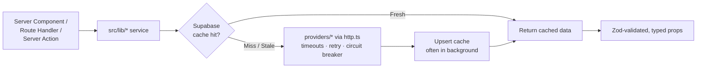

<div align="center">


<br />
<br />

# 🌆 Best City Spots

### Premium urban-intelligence for deliberate travelers

Search, compare, and explore the world's most vibrant cities with **AI-assisted briefings**, **live weather & air quality**, **curated places**, and **city-level metrics** — wrapped in a refined *liquid-glass* UI.

<br />

[](LICENSE)
[](https://nextjs.org/)
[](https://react.dev/)
[](https://www.typescriptlang.org/)
[](https://tailwindcss.com/)
[](https://supabase.com/)

<br />

[Overview](#-overview) ·
[Features](#-feature-highlights) ·
[Tech Stack](#-tech-stack) ·
[Architecture](#-architecture) ·
[Getting Started](#-getting-started) ·
[Scripts](#-scripts) ·
[Deployment](#-deployment) ·
[License](#-license)

</div>

---

## 📑 Table of Contents

- [Overview](#-overview)
- [Feature Highlights](#-feature-highlights)
- [Tech Stack](#-tech-stack)
- [Architecture](#-architecture)
- [API Surface](#-api-surface)
- [Getting Started](#-getting-started)
- [Environment Variables](#-environment-variables)
- [Project Structure](#-project-structure)
- [Scripts](#-scripts)
- [Deployment](#-deployment)
- [Contributing](#-contributing)
- [License](#-license)

---

## 🧭 Overview

**Best City Spots** is a single Next.js 16 application that blends a polished product UI with a
cost-aware, cache-first backend. It pulls together AI insight, live environmental data, curated
points of interest, and quantitative city metrics into one fast, beautiful experience.

**Who it's for**

- 🧳 **Deliberate travelers** who want a curated, data-backed read on a city before they go.
- 🌍 **Digital nomads** comparing cities on cost, connectivity, air quality, and climate comfort.
- 📊 **The curious** who enjoy exploring the world through an interactive, metric-rich lens.

> [!NOTE]
> This repository is published as a **personal / portfolio project** for reference. It is shared
> under the MIT license — feel free to read, learn from, and adapt it.

<div align="right">

[↑ Back to top](#-best-city-spots)

</div>

---

## ✨ Feature Highlights

| | Feature | What it does |
| :---: | :--- | :--- |
| 🤖 | **AI city briefings** | Google Gemini (`gemini-3-flash-preview`) generates intros, attractions, seasonal guidance, and weather prep — streamed over **SSE** and Zod-validated. Falls back to OpenAI automatically. |
| 📍 | **Curated places** | Top experiences, restaurants, and hotels from the **Google Places API (New)**, ranked with a Bayesian engine, with BlurHash placeholders and a Supabase Storage image cache. |
| 🌦️ | **Live conditions** | Real-time weather and AQI via **OpenWeatherMap**, with pollution & climate-comfort signals from **Open-Meteo**, refreshed every 60 minutes. |
| 📈 | **City metrics** | Cost-of-living, safety, connectivity, pollution, and health-access aggregates per city. |
| 🔎 | **Multi-mode search** | Postgres full-text + trigram fuzzy + alias RPC (`search_cities_elastic`), recent-search memory, and GPS-based nearest-city lookup. |
| 🪩 | **Sphere visualization** | An interactive 3D city sphere with category, population, and per-category modes. |
| 🗂️ | **SEO topical hubs** | Curated landing routes for air quality, digital nomads, and 12 month-by-month destination guides. |
| ⚡ | **Layered caching** | Tiered TTLs in Supabase with `schemaVersion` / `prompt_version` invalidation and stale-while-revalidate refreshes. |
| 🛡️ | **Hardened HTTP** | Per-provider circuit breakers, timeouts, retry + jitter, and a daily call-limit **cost guard** for paid APIs. |
| 🔒 | **Privacy-first analytics** | Aggregate-only daily tables, GDPR geo-consent banner, and no per-user profiling. |

<div align="right">

[↑ Back to top](#-best-city-spots)

</div>

---

## 🛠️ Tech Stack

| Category | Technologies |
| :--- | :--- |
| **Framework** | Next.js 16 (App Router) · React 19 · TypeScript 5 (strict) |
| **Styling** | Tailwind CSS 4 · liquid-glass CSS custom properties · `next-themes` |
| **Database / Storage** | Supabase — Postgres, RLS, Storage (`place_images` bucket) |
| **AI** | Google Generative AI — Gemini (`gemini-3-flash-preview`) with OpenAI fallback |
| **External APIs** | Google Places (New) · OpenWeatherMap · Open-Meteo |
| **Validation** | Zod — inputs, AI/provider outputs, and typed env vars |
| **UI / Motion** | Framer Motion · Lucide icons · Leaflet maps |
| **Imaging** | Sharp (server-side) · BlurHash placeholders |
| **Tooling** | ESLint 9 + `eslint-plugin-security` · Prettier · `tsx` |
| **Build / Deploy** | Standalone Next build · Dockerfile · `docker-compose.yml` |

<div align="right">

[↑ Back to top](#-best-city-spots)

</div>

---

## 🏗️ Architecture

A layered monolith: route handlers and server actions stay thin, while all business logic, provider
calls, and database access live in the `src/lib/` service layer. Reads are **cache-first** with
stale-while-revalidate refreshes to keep latency low and third-party API cost bounded.



**Cache tiers** (see [`src/lib/cache-config.ts`](src/lib/cache-config.ts)):

| Cache table | Fresh | Soft refresh | Purpose |
| :--- | :--- | :--- | :--- |
| `city_ai_insights` | 365 d | 30 d | Gemini city briefings |
| `city_places_cache` · `place_details_cache` | 30 d | 7 d | Google Places landmarks & details |
| `city_weather_cache` | 60 m | 30 m | Weather + AQI snapshots |
| `city_metrics` | 60 m | 30 m | Cost, safety, connectivity, pollution, health |
| `ai_trending_cache` | 24 h | 12 h | AI trending destinations |

> Invalidate by bumping `CACHE_TIERS[*].schemaVersion` in `src/lib/cache-config.ts`, or
> `PROMPT_VERSIONS` in `src/lib/providers/gemini.ts` for AI output. Mismatches are treated as a
> cache miss — no data migration required.

**Security highlights**

- Public-read app; privileged writes are restricted to `service_role` (server-only).
- Supabase RLS is the primary boundary — review it on every table / policy change.
- All inputs and AI/provider outputs are validated with Zod.
- Hardened response headers (HSTS, `X-Frame-Options`, `X-Content-Type-Options`, `Referrer-Policy`)
  are configured in [`next.config.ts`](next.config.ts).
- `SUPABASE_SERVICE_ROLE_KEY` and provider keys are never exposed to the client.

<div align="right">

[↑ Back to top](#-best-city-spots)

</div>

---

## 🔌 API Surface

| Endpoint | Method | Description |
| :--- | :---: | :--- |
| `/api/analytics` | `POST` | Batched, size-limited, privacy-conscious analytics ingestion. |
| `/api/cities/sphere` | `GET` | Sphere visualization data (`mode=categories \| population \| category`). |
| `/api/cities/insight` | `GET` | SSE-streamed AI city briefing (`stale` → `chunk` → `complete`). |
| `/api/places/search` | `GET` | Filtered places search (type, rating, price tier, sort, paging, geo). |
| `/api/health` | `GET` | Dependency health — token-gated detail via `HEALTH_CHECK_TOKEN`. |

<div align="right">

[↑ Back to top](#-best-city-spots)

</div>

---

## 🚀 Getting Started

### Prerequisites

- **Node.js** 20.x+ and **npm** 10.x+
- A **Supabase** project (for the database, RLS, and storage)
- Optional API keys for live data: Google Gemini, Google Places, OpenWeatherMap *(the app degrades
  gracefully when these are absent)*

### 1. Clone & install

```bash
git clone https://github.com/AwaleSagar/bestcityspots.git
cd bestcityspots
npm install
```

### 2. Configure environment

Create a `.env.local` in the repo root. All keys are optional at build time — placeholder values are
enough for `lint`, `type-check`, and `build`. See [Environment Variables](#-environment-variables)
for the full reference and [`docs/external-services-setup.md`](docs/external-services-setup.md) for a
provider-by-provider setup walkthrough.

```env
# Supabase (public)
NEXT_PUBLIC_SUPABASE_URL=https://your-project.supabase.co
NEXT_PUBLIC_SUPABASE_ANON_KEY=your_anon_key

# Supabase (server-only — required for cache writes / admin paths)
SUPABASE_SERVICE_ROLE_KEY=your_service_role_key

# Providers (server-only)
GOOGLE_PLACES_API_KEY=your_google_places_key
OPENWEATHERMAP_API_KEY=your_openweathermap_key
GOOGLE_GEMINI_API_KEY=your_gemini_key
```

### 3. Set up the database

SQL lives under [`supabase/`](supabase/). Baseline files sit at the directory root; incremental
changes go in `supabase/migrations/<YYYYMMDDHHMM>_<short_description>.sql` (idempotent, one concern
per file — see [`supabase/migrations/README.md`](supabase/migrations/README.md)).

```bash
# Apply migrations in order
for f in supabase/migrations/*.sql; do
  psql "$DATABASE_URL" -v ON_ERROR_STOP=1 -f "$f"
done
```

### 4. Run the dev server

```bash
npm run dev   # → http://localhost:3000
```

> [!IMPORTANT]
> **Cost & safety.** Paid providers (Gemini, Google Places, OpenAI) are gated by per-day limits in
> [`src/lib/cost-guard.ts`](src/lib/cost-guard.ts) and the `*_LIVE_FETCH_ENABLED` flags — which
> default to `false`. Keep them off in development to avoid unexpected API spend; flip them on only
> when you intend to make live calls.

<div align="right">

[↑ Back to top](#-best-city-spots)

</div>

---

## 🔑 Environment Variables

Read env through `publicEnv()` / `serverEnv()` from [`src/lib/env.ts`](src/lib/env.ts) — never
`process.env` directly. Use `requireServerEnv(key)` when a value is mandatory at the call site. Only
`NEXT_PUBLIC_*` variables are reachable from the client; everything else is server-only.

<details>
<summary><strong>Public variables</strong> (<code>NEXT_PUBLIC_*</code>, client-accessible)</summary>

<br />

| Variable | Description |
| :--- | :--- |
| `NEXT_PUBLIC_SUPABASE_URL` | Supabase project URL. |
| `NEXT_PUBLIC_SUPABASE_ANON_KEY` | Supabase anon/public key. |
| `NEXT_PUBLIC_SITE_URL` | Canonical app URL (SSR, analytics, metadata). |
| `NEXT_PUBLIC_GOOGLE_SITE_VERIFICATION` | Google Search Console verification token. |
| `NEXT_PUBLIC_ANALYTICS_DEV` | Enable dev analytics logging. |
| `NEXT_PUBLIC_ORGANIZATION_SAME_AS` | Comma-separated social/brand URLs (JSON-LD `sameAs`). |
| `NEXT_PUBLIC_CONTACT_EMAIL` | Contact email for schema markup. |
| `NEXT_PUBLIC_BOOKING_AFFILIATE_ID` | Booking.com affiliate ID for affiliate links. |

</details>

<details>
<summary><strong>Server-only variables</strong> (never exposed to the client)</summary>

<br />

| Variable | Description | Default |
| :--- | :--- | :--- |
| `SUPABASE_SERVICE_ROLE_KEY` | Supabase service role key (admin writes). | — |
| `GOOGLE_PLACES_API_KEY` | Google Places API key. | — |
| `GOOGLE_GEMINI_API_KEY` | Google Gemini API key. | — |
| `OPENAI_API_KEY` | OpenAI fallback API key. | — |
| `OPENWEATHERMAP_API_KEY` | OpenWeatherMap API key (free tier). | — |
| `AI_PROVIDER` | Preferred AI engine (`gemini` \| `openai`); the other is fallback. | `gemini` |
| `GOOGLE_PLACES_LIVE_FETCH_ENABLED` | Gate live Google Places calls. | `false` |
| `GOOGLE_GEMINI_LIVE_FETCH_ENABLED` | Gate live Gemini calls. | `false` |
| `OPENAI_LIVE_FETCH_ENABLED` | Gate live OpenAI calls. | `false` |
| `GOOGLE_PLACES_DAILY_CALL_LIMIT` | Daily call cap for Places. | `100` |
| `GOOGLE_GEMINI_DAILY_CALL_LIMIT` | Daily call cap for Gemini. | `25` |
| `OPENAI_DAILY_CALL_LIMIT` | Daily call cap for OpenAI. | `25` |
| `LOG_LEVEL` | Logger verbosity (`debug` \| `info` \| `warn` \| `error`). | `info` |
| `HEALTH_CHECK_TOKEN` | Bearer token gating `/api/health` detail. | — |

</details>

<div align="right">

[↑ Back to top](#-best-city-spots)

</div>

---

## 📂 Project Structure

<details open>
<summary><strong>Top-level layout</strong></summary>

<br />

```text
.
├── src/
│   ├── app/            # Next.js App Router — routes, layouts, server actions, api/*
│   ├── components/     # UI: analytics, effects, features, layout, pages, sections, seo, ui
│   ├── hooks/          # useDeviceType, useNetworkQuality, useRecentSearches
│   ├── config/         # Static config (nav)
│   └── lib/            # Service layer — DB access, providers, AI, caching, validation
├── supabase/           # SQL: schema, RLS, RPCs + timestamped migrations/
├── scripts/            # Operational TS/shell tools (cache warm, analytics, seeds, tests)
├── data/               # Local seed data
├── public/             # Static assets (images, videos, illustrations)
├── docs/               # ADRs, external-services setup, design tokens
├── deploy/             # nginx + ansible deployment artifacts
├── Dockerfile          # Multi-stage standalone build
├── docker-compose.yml
├── next.config.ts      # Hardened response headers
└── package.json
```

</details>

<details>
<summary><strong>Service layer</strong> (<code>src/lib/</code>) — where all logic lives</summary>

<br />

| File | Role |
| :--- | :--- |
| `supabase.ts` | Lazy Supabase clients (anon + service-role). |
| `env.ts` | Typed env access: `publicEnv()`, `serverEnv()`, `requireServerEnv`. |
| `http.ts` | Outbound HTTP: timeouts, retry + jitter, per-provider circuit breaker. |
| `providers/{gemini,openai,googlePlaces,openweather,openMeteo}.ts` | Provider wrappers (all route through `http.ts`). |
| `intelligence.ts` | Gemini AI insights — cache-first via `city_ai_insights`. |
| `places.ts`, `place-search-utils.ts` | Google Places fetch + search filters. |
| `weather.ts` | Weather + AQI with cache. |
| `metrics.ts` | City metrics aggregation. |
| `cities.ts` | City lookup + search (RPC `search_cities_elastic`). |
| `ranking.ts` | Bayesian ranking for places. |
| `cache.ts`, `cache-config.ts` | Cache TTL tiers + `schemaVersion` invalidation. |
| `validation.ts` | Shared Zod schemas (inputs + AI/provider outputs). |
| `cost-guard.ts` | Daily call-limit guard for paid providers. |
| `analytics.ts`, `useAnalytics.ts` | Privacy-conscious visitor analytics. |
| `countries.ts`, `topical-hubs.ts`, `sphere-categories.ts` | SEO hub helpers + curated category sets. |
| `logger.ts`, `health.ts`, `geo.ts`, `format.ts`, `image-transforms.ts`, `storage.ts` | Utilities. |

</details>

<div align="right">

[↑ Back to top](#-best-city-spots)

</div>

---

## 📜 Scripts

<details open>
<summary><strong>Development & build</strong></summary>

<br />

| Command | Description |
| :--- | :--- |
| `npm run dev` | Start the dev server on port 3000. |
| `npm run build` | Production build (standalone Next output). |
| `npm run start` | Start the production server. |
| `npm run type-check` | Type-check with `tsc --noEmit`. |
| `npm run lint` | ESLint (includes `eslint-plugin-security`). |
| `npm run lint:fix` | ESLint with auto-fix. |
| `npm run format` | Prettier write across the codebase. |
| `npm run format:check` | Prettier check (no writes). |

</details>

<details>
<summary><strong>Operations & verification</strong></summary>

<br />

| Command | Description |
| :--- | :--- |
| `npm run warm-cache` | Warm AI / trending / places caches. |
| `npm run warm-cache:trending` | Warm trending destinations only. |
| `npm run warm-cache:dry-run` | Plan cache warming with no writes. |
| `npm run analytics` | Visitor analytics report (7-day default). |
| `npm run analytics:30d` | Analytics report over a 30-day window. |
| `npm run analytics:json` | Analytics report as JSON. |
| `npm run import:cost` | Import the cost-of-living index. |
| `npm run test` | Run metrics + share-list checks. |
| `npm run test:refactor` | Cross-cutting refactor verification. |
| `npm run test:google-places` | Google Places integration smoke test. |
| `npm run test:supabase` | Supabase backend smoke tests (`:json` variant available). |
| `npm run test:metrics` · `npm run test:share` | Targeted metrics / share-list checks. |

</details>

<div align="right">

[↑ Back to top](#-best-city-spots)

</div>

---

## 🐳 Deployment

The app builds to a **standalone** Next.js output and ships with a multi-stage `Dockerfile` and
`docker-compose.yml` (Node 20 Alpine). Production deployment artifacts (nginx reverse proxy,
optional Ansible provisioning) live under [`deploy/`](deploy/).

```bash
# Build the image — public NEXT_PUBLIC_* vars are baked in at build time
docker build -t bestcityspots \
  --build-arg NEXT_PUBLIC_SUPABASE_URL=... \
  --build-arg NEXT_PUBLIC_SUPABASE_ANON_KEY=... \
  .

# Run — runtime secrets flow through the env file
docker run -p 3000:3000 --env-file .env.local bestcityspots
```

Or with Compose:

```bash
docker compose up --build
```

The app is stateless at the Next.js layer, so it scales horizontally behind a load balancer. Keep
the hardened response headers in [`next.config.ts`](next.config.ts) intact.

<div align="right">

[↑ Back to top](#-best-city-spots)

</div>

---

## 🤝 Contributing

This is a personal project, but thoughtful issues and pull requests are welcome. Before submitting,
please review the project conventions:

- [`CONTRIBUTING.md`](CONTRIBUTING.md) — workflow and expectations
- [`CODE_STYLE.md`](CODE_STYLE.md) — coding standards
- [`AGENTS.md`](AGENTS.md) · [`PROJECT.md`](PROJECT.md) — architecture and deeper context

Run the safety rails before pushing:

```bash
npm run lint && npm run type-check && npm run build
```

<div align="right">

[↑ Back to top](#-best-city-spots)

</div>

---

## 📄 License

Released under the [MIT License](LICENSE) — © 2026 Sagar Awale.

<div align="center">

<br />

**Built with care for people who travel deliberately.**

</div>
